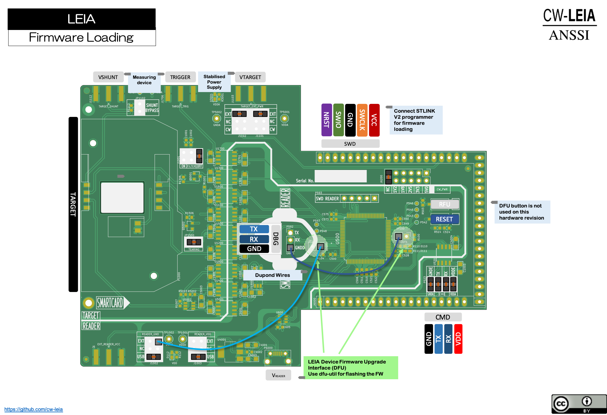
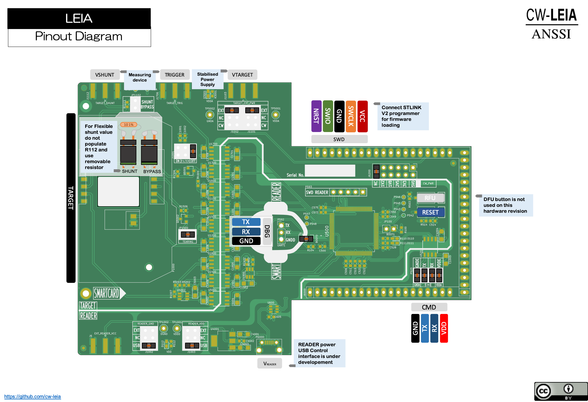

.. _hardware_quickstart:

Hardware Quickstart
-------------------------

PCB Version X
^^^^^^^^^^^^^

Enabling DFU Bootloader and flashing the Firmware
=================================================

The actual version of LEIA can be flashed using the following wiring layout. This has been fixed in the new version that should be published soon.

Then connect the USB cable to your workstation and open a terminal console.

Enumerating USB devices
========================

:: 

     $ lsusb

     Bus 020 Device 002: ID 0483:df11 STMicroelectronics STM32  BOOTLOADER  Serial: 326433593336

Enumerating DFU USB device alternate functions
==============================================

::

     $ dfu-util -l                                                                                                                                      64 ↵

     dfu-util 0.9

     Copyright 2005-2009 Weston Schmidt, Harald Welte and OpenMoko Inc.
     Copyright 2010-2016 Tormod Volden and Stefan Schmidt
     This program is Free Software and has ABSOLUTELY NO WARRANTY
     Please report bugs to http://sourceforge.net/p/dfu-util/tickets/

     Deducing device DFU version from functional descriptor length
     Found Runtime: [05ac:821d] ver=0156, devnum=8, cfg=1, intf=3, path="29-1.8.1.3", alt=0, name="UNKNOWN", serial="UNKNOWN"
     Found DFU: [0483:df11] ver=2200, devnum=2, cfg=1, intf=0, path="20-2", alt=3, name="@Device Feature/0xFFFF0000/01*004 e", serial="326433593336"
     Found DFU: [0483:df11] ver=2200, devnum=2, cfg=1, intf=0, path="20-2", alt=2, name="@OTP Memory /0x1FFF7800/01*512 e,01*016 e", serial="326433593336"
     Found DFU: [0483:df11] ver=2200, devnum=2, cfg=1, intf=0, path="20-2", alt=1, name="@Option Bytes  /0x1FFFC000/01*016 e/0x1FFEC000/01*016 e", serial="326433593336"
     Found DFU: [0483:df11] ver=2200, devnum=2, cfg=1, intf=0, path="20-2", alt=0, name="@Internal Flash  /0x08000000/04*016Kg,01*064Kg,07*128Kg,04*016Kg,01*064Kg,07*128Kg", serial="326433593336"

Flashing the LEIA Firwmare
==========================

:: 

     $ dfu-util -d 0483:df11 -a 0 --dfuse-address=0x08000000 -D build/firmware.bin

If this is not working for you need to use and STLINK adapter connected to P593 (SWD READER)

Flashing and debugging LEIA Firmware
====================================

It is mandatory to connect an STLINK adapter to P593 (SWD READER) to enable debugging.

If you do not have any STLINK adapter you can buy one here :
https://www.amazon.com/DAOKI-ST-Link-Programming-Emulator-Downloader/dp/B01EE4WAC8/

You can also use the STLINK that is shipped with some ST development boards like this one : 
https://www.amazon.com/STM32F4DISCOVERY-STM32F407-Discovery-Evaluation-Development/dp/B00CW9AKDY/

Since you are using the CW308-Board to interface the LEIA board to the chipwisperer you have to bridge P525. You also need to put some jumper according to the following picture :

